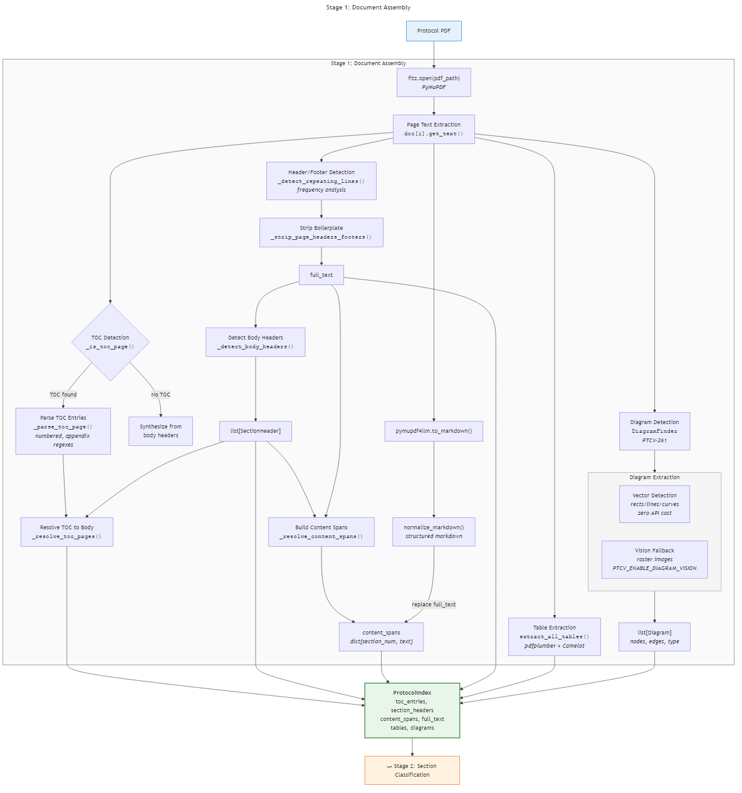
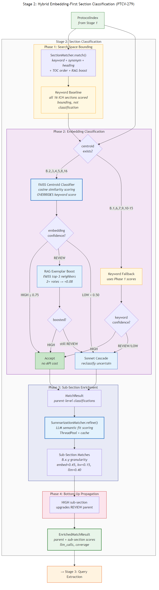
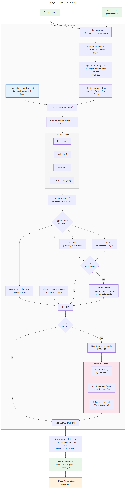
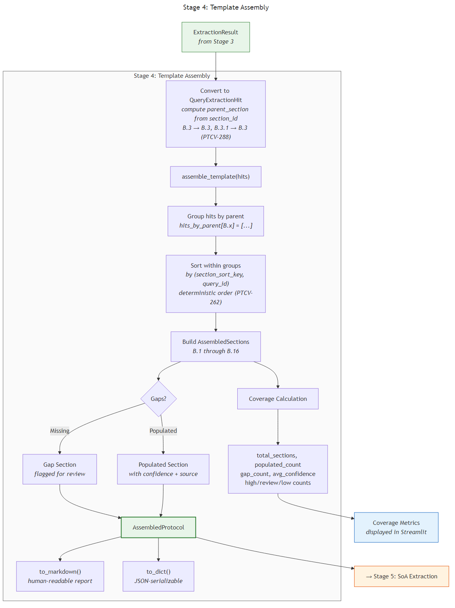
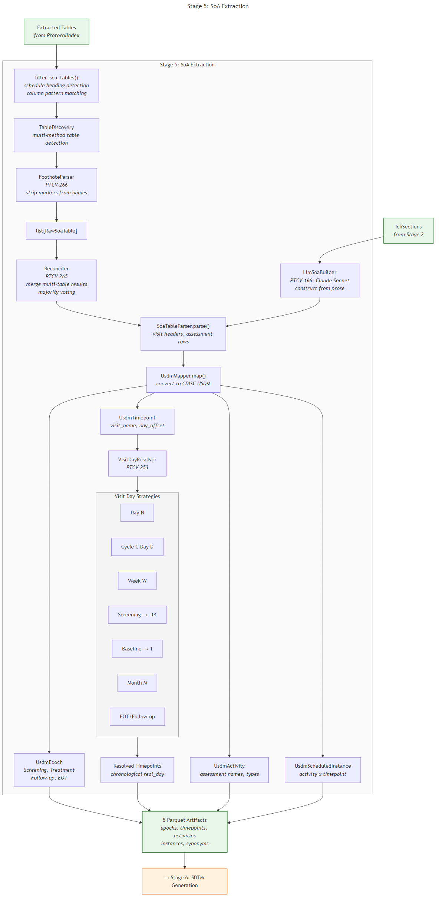
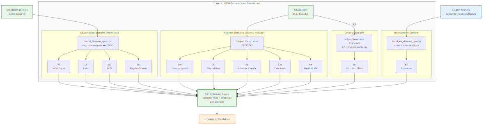
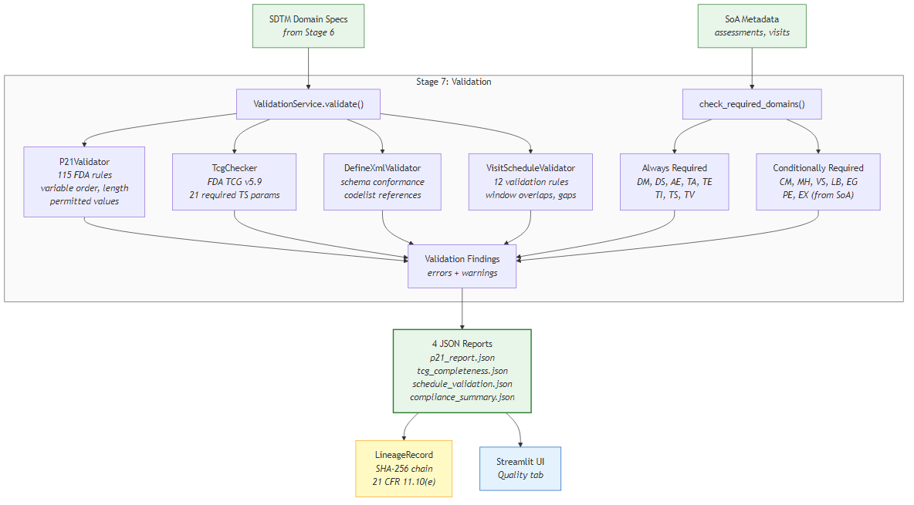
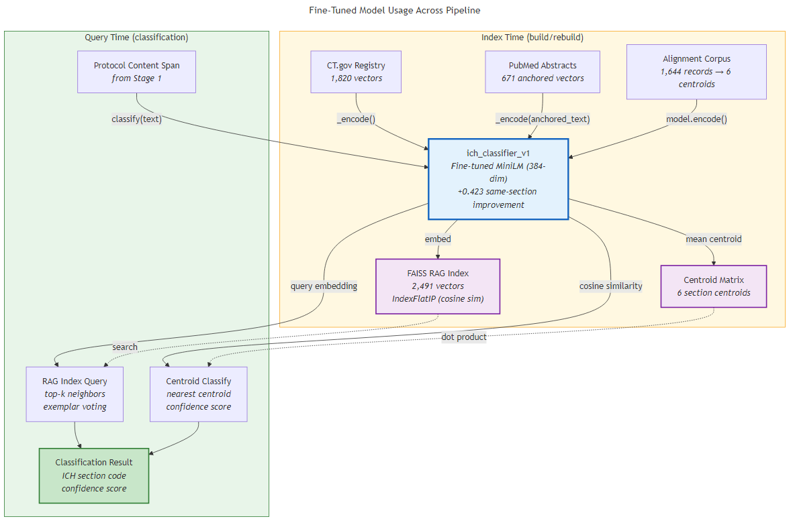
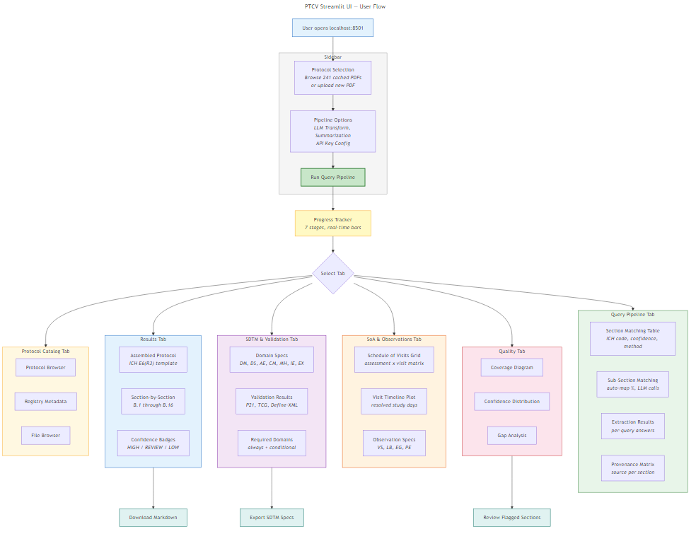

# Protocol-To-Cohort-Viz (PTCV)

> ML-powered clinical trial protocol extraction pipeline that transforms PDF protocols into
> CDISC SDTM-compliant datasets with interactive Schedule of Activities visualizations.

## Overview

PTCV ingests clinical trial protocols from ClinicalTrials.gov and EU-CTR, extracts structured
content from PDF documents, classifies sections against the ICH E6(R3) Appendix B format,
and generates CDISC USDM v4.0 Schedule of Activities models with SDTM trial design datasets.

The system uses a **7-stage query-driven pipeline** with embedding-first section classification,
adaptive extraction strategies, and multi-source data enrichment from CT.gov registry metadata
and PubMed journal abstracts.

All artifact writes are immutable (WORM) with a tamper-evident SHA-256 lineage chain,
satisfying 21 CFR Part 11, ICH E6(R3), and ALCOA+ requirements.

### Key Capabilities

- **Protocol parsing** — PyMuPDF text extraction, TOC detection, section header mapping, table and diagram extraction
- **ICH classification** — Hybrid embedding-first classifier using FAISS centroid vectors, RAG exemplar voting, and Sonnet cascade
- **Query extraction** — 120+ queries across all 16 ICH Appendix B sections with adaptive format detection and gap recovery
- **Schedule of Activities** — Automated SoA table parsing with visit day resolution and chronological ordering
- **SDTM generation** — 11 domain spec generators (DM, DS, AE, CM, MH, IE, EX, VS, LB, EG, PE) with CDISC controlled terminology
- **Validation** — P21 (115 FDA rules), TCG v5.9, Define-XML schema, visit schedule validation
- **Streamlit UI** — Interactive protocol browser with 6 content tabs, real-time 7-stage progress tracking

---

## Pipeline Architecture

The query pipeline processes protocols through 7 sequential stages:

```
PDF → Document Assembly → Section Classification → Query Extraction
    → Template Assembly → SoA Extraction → SDTM Generation → Validation
```

### Stage 1: Document Assembly

Extracts a navigable `ProtocolIndex` from protocol PDFs including TOC entries, section headers,
content spans, structured tables (pdfplumber + Camelot), and diagrams (vector detection + Vision API fallback).



*Source: [stage1-document-assembly.mmd](docs/diagrams/stage1-document-assembly.mmd)*

### Stage 2: Section Classification

Hybrid embedding-first classifier that uses FAISS centroid vectors as the primary classification
signal for sections with centroids, keyword scoring as fallback for sections without, and
LLM sub-section scoring via SummarizationMatcher.

- **Phase 1** — TOC + keywords bound the search space (no classification decisions)
- **Phase 2** — FAISS centroids classify where available; keyword fallback for remaining sections
- **Phase 3** — LLM sub-section enrichment (3-signal composite: embed=0.45, keyword=0.15, LLM=0.40)
- **Phase 4** — Bottom-up propagation: HIGH sub-sections upgrade REVIEW parents



*Source: [stage2-section-classification.mmd](docs/diagrams/stage2-section-classification.mmd)*

### Stage 3: Query Extraction

Processes ~120 queries from the Appendix B YAML schema against routed content spans. Features
adaptive content format detection (auto-detects table/list/prose structure) and a 3-level gap
recovery cascade (alternative strategy → adjacent section search → registry fallback).



*Source: [stage3-query-extraction.mmd](docs/diagrams/stage3-query-extraction.mmd)*

### Stage 4: Template Assembly

Groups extraction hits by ICH parent section (B.1–B.16), sorts subsections deterministically,
computes coverage metrics, and produces an `AssembledProtocol` with populated sections,
gap placeholders, and confidence badges.



*Source: [stage4-template-assembly.mmd](docs/diagrams/stage4-template-assembly.mmd)*

### Stage 5: SoA Extraction

Parses Schedule of Activities tables from PDF content, resolves visit labels to absolute study
days (7 resolution strategies), and produces CDISC USDM v4.0 entities (epochs, timepoints,
activities, scheduled instances).



*Source: [stage5-soa-extraction.mmd](docs/diagrams/stage5-soa-extraction.mmd)*

### Stage 6: SDTM Generation

Generates SDTM domain specifications from SoA data, protocol sections, and registry metadata.
Produces observation domains (VS, LB, EG, PE) from assessments, subject domains (DM, DS, AE,
CM, MH) from protocol text, IE domain from inclusion/exclusion criteria (17 criterion patterns),
and EX domain from arm/intervention structure.



*Source: [stage6-sdtm-generation.mmd](docs/diagrams/stage6-sdtm-generation.mmd)*

### Stage 7: Validation

Validates generated SDTM specs against FDA requirements: P21 validator (115 rules), TCG checker
(FDA TCG v5.9, 21 required TS parameters), Define-XML schema conformance, and visit schedule
validation (12 rules for window overlaps and gaps).



*Source: [stage7-validation.mmd](docs/diagrams/stage7-validation.mmd)*

---

## Embedding & Classification

The pipeline uses a fine-tuned sentence-transformer model (`ich_classifier_v1`, +0.423
same-section similarity improvement via SetFit contrastive training) for all embedding operations.

The FAISS RAG index contains **2,491 vectors** from two sources:
- **1,820 registry vectors** — CT.gov structured metadata mapped to ICH sections
- **671 PubMed vectors** — section-anchored journal article abstract chunks

Section-anchored embedding bridges the domain gap between journal prose and protocol text
by prefixing each chunk with its ICH section code (e.g., `"B.4 Trial Design: ..."`).



*Source: [embedding-model-flow.mmd](docs/diagrams/embedding-model-flow.mmd)*

---

## Streamlit UI

The application provides an interactive protocol browser with 6 content tabs:



*Source: [ui-user-flow.mmd](docs/diagrams/ui-user-flow.mmd)*

| Tab | Content |
|-----|---------|
| **Query Pipeline** | Section matching, sub-section scoring, extraction results, provenance matrix |
| **Results** | Assembled ICH E6(R3) template with confidence badges |
| **SoA & Observations** | Schedule of visits grid, visit timeline, observation domain specs |
| **SDTM & Validation** | Domain specs (11 domains), P21/TCG/Define-XML validation results |
| **Quality** | Coverage diagram, confidence distribution, gap analysis |
| **Protocol Catalog** | Browse 241 cached protocols, registry metadata, file browser |

---

## Getting Started

### Prerequisites

- Python 3.12+
- Node.js (for Mermaid diagram rendering)
- Anthropic API key (optional — for LLM features)

### Setup

```bash
git clone https://github.com/LittleHubOnThePrairie/Protocol-To-Cohort-Viz.git
cd Protocol-To-Cohort-Viz

python -m venv .venv
source .venv/bin/activate  # or .venv\Scripts\activate on Windows

pip install -r requirements.txt
```

### Configuration

```bash
cp .secrets.example .secrets
# Edit .secrets with your API keys

# Load secrets into environment
source ./load-secrets.sh  # or . .\load-secrets.ps1 on Windows
```

### Running

```bash
# Start Streamlit UI
python -m streamlit run src/ptcv/ui/app.py

# Run tests
python -m pytest tests/ -v

# Regenerate diagrams
npm install -g @mermaid-js/mermaid-cli
for f in docs/diagrams/*.mmd; do npx mmdc -i "$f" -o "${f%.mmd}.png" -t default -b white -w 1200; done
```

---

## Project Structure

```
src/ptcv/
  ich_parser/          # Stage 2-4: Classification, extraction, assembly
    section_classifier.py    # Hybrid embedding-first classifier (PTCV-279)
    section_matcher.py       # Keyword scoring (search-space bounding)
    summarization_matcher.py # LLM sub-section scoring
    centroid_classifier.py   # FAISS centroid classification (PTCV-234)
    query_extractor.py       # Stage 3: 9 extraction strategies
    content_format_detector.py # Adaptive format detection (PTCV-257)
    gap_recovery.py          # 3-level gap recovery (PTCV-258)
    template_assembler.py    # Stage 4: ICH template assembly
    rag_index.py             # FAISS RAG index (2,491 vectors)
    toc_extractor.py         # Stage 1: TOC + section header extraction

  extraction/           # PDF processing
    pdf_extractor.py         # PyMuPDF text extraction
    table_extractor.py       # pdfplumber + Camelot tables
    diagram_finder.py        # Vector + Vision diagram detection (PTCV-243)
    markdown_normalizer.py   # pymupdf4llm normalization

  soa_extractor/        # Stage 5: Schedule of Activities
    extractor.py             # SoA extraction orchestrator
    parser.py                # Pipe-table and aligned-table parsing
    mapper.py                # CDISC USDM v4.0 mapping
    visit_day_resolver.py    # 7 visit day resolution strategies (PTCV-253)
    reconciler.py            # Multi-table merge (PTCV-265)
    footnote_parser.py       # Assessment name cleanup (PTCV-266)

  sdtm/                 # Stage 6: SDTM generation
    domain_generators.py     # Observation domains (VS, LB, EG, PE)
    subject_domain_generators.py # Subject domains (DM, DS, AE, CM, MH)
    ie_domain_generator.py   # IE domain from criteria (PTCV-247)
    ex_domain_builder.py     # EX domain from arm structure
    validation/              # Stage 7: P21, TCG, Define-XML, schedule

  registry/             # CT.gov + PubMed data sources
    metadata_fetcher.py      # CT.gov API v2 fetcher/cache
    ich_mapper.py            # Registry → ICH section mapping
    rag_seeder.py            # FAISS index seeding
    pubmed_vector_builder.py # Section-anchored PubMed embeddings (PTCV-286)
    query_injector.py        # Query-level registry injection (PTCV-259)

  ui/                   # Streamlit application
    app.py                   # Main app entry point
    components/              # Tab components and widgets

  pipeline/             # Pipeline orchestration
    query_pipeline_lineage.py # SHA-256 lineage chain (PTCV-241)

data/
  templates/             # ICH E6(R3) YAML schema
  rag_index/             # FAISS index (2,491 vectors)
  models/                # Fine-tuned sentence-transformer
  protocols/             # 241 cached protocol PDFs + registry metadata

docs/
  diagrams/              # Mermaid source (.mmd) + rendered PNG
  analysis/              # PubMed abstract analysis (PTCV-287)
  TEST_COVERAGE_MAP.md   # Test ↔ module ↔ feature mapping
```

---

## Testing

| Category | Test Files | Tests | Coverage |
|----------|-----------|-------|----------|
| ich_parser | 35 | 1,037 | 100% |
| sdtm | 17 | 678 | 100% |
| ui | 45 | 675 | 97.8% |
| soa_extractor | 22 | 529 | 95.7% |
| extraction | 11 | 273 | 100% |
| registry | 13 | 278 | 92.9% |
| Other | 17 | 590 | 100% |
| **Total** | **160** | **3,560+** | **97.6%** |

See [TEST_COVERAGE_MAP.md](docs/TEST_COVERAGE_MAP.md) for complete test ↔ module ↔ feature mapping.

```bash
# Run full suite
python -m pytest tests/ -v

# Run specific stage tests
python -m pytest tests/ich_parser/ -v          # Stages 2-4
python -m pytest tests/soa_extractor/ -v       # Stage 5
python -m pytest tests/sdtm/ -v               # Stages 6-7
python -m pytest tests/ui/ -v                 # UI components
```

---

## Data Sources

| Source | Records | Coverage | Update |
|--------|---------|----------|--------|
| ClinicalTrials.gov PDFs | 241 protocols | Full pipeline input | Cached |
| CT.gov Registry (API v2) | 241 JSON responses | 8 ICH sections | Cached |
| PubMed Abstracts | 159 articles (98 protocols) | 6 ICH sections | Cached |
| Alignment Corpus | 1,644 records (185 protocols) | 6 section centroids | Static |
| Fine-tuned Model | ich_classifier_v1 (384-dim) | +0.423 improvement | Static |

---

## Regulatory Compliance

- **ICH E6(R3)** — Appendix B section structure as extraction template
- **CDISC USDM v4.0** — Schedule of Activities entity model
- **CDISC SDTM** — Trial design domain specifications with controlled terminology
- **21 CFR Part 11** — Immutable WORM storage, SHA-256 lineage chain
- **ALCOA+** — Attributable, Legible, Contemporaneous, Original, Accurate

---

## Related Documentation

- [CONTRIBUTING.md](CONTRIBUTING.md) — GxP-compliant development workflow
- [TEST_COVERAGE_MAP.md](docs/TEST_COVERAGE_MAP.md) — Complete test mapping
- [Confluence: Embedding Strategy](https://littlehubonprairie.atlassian.net/spaces/PTCV/) — Vector generation methodology
- [Jira: PTCV Project](https://littlehubonprairie.atlassian.net/jira/software/projects/PTCV/board) — Issue tracking
